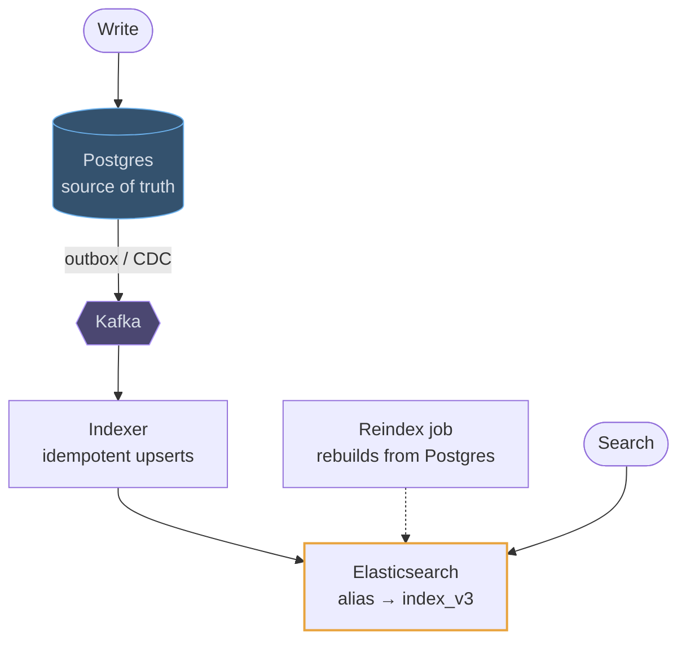
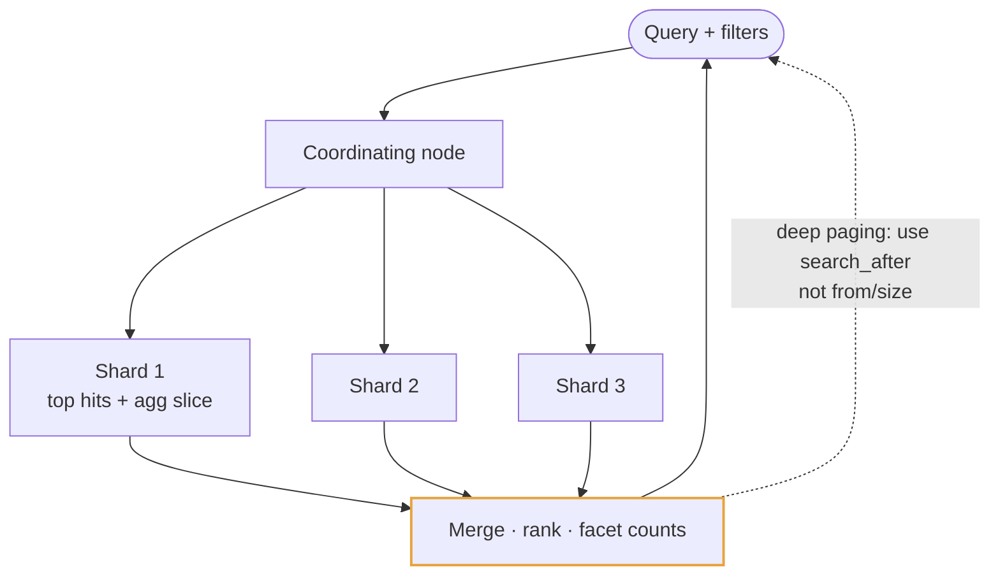
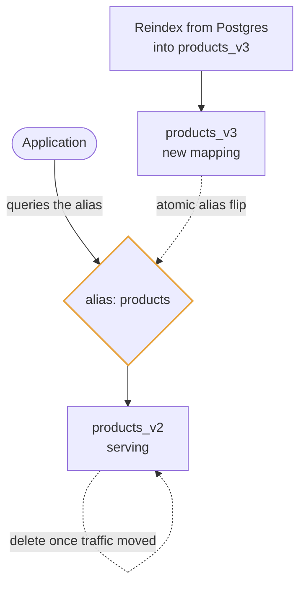

# Elasticsearch

## Use cases

### A search index kept in sync by a change stream

The architectural claim that earns marks: writes go to the database, and the
index is fed from its change stream by an idempotent consumer. Dual-writing from
the application is the anti-pattern being listened for, and a reindex job is what
makes a bad mapping or a dropped message recoverable.



### Typeahead in fifty milliseconds

Edge n-grams index "sys", "syst", "syste" at write time, so a prefix query is a
plain term lookup rather than a wildcard scan. Put a cache of popular prefixes in
front and the common case never reaches the cluster at all.

```mermaid
flowchart TB
    Key([Keystroke "sys"]) --> Cache{{"Redis<br/>top-10 per popular prefix"}}
    Cache -- "hit · ~1 ms" --> Key
    Cache -. "miss" .-> ES["Elasticsearch<br/>edge n-gram field"]
    ES -- "term lookup, not a wildcard" --> Key
    Index([Document indexed]) -- "sys · syst · syste · system" --> ES
    ES -. "fuzzy: edit distance 1<br/>catches typos" .-> ES

    classDef cache fill:#4b4771,stroke:#ad94f7,color:#d7dee8
    classDef hot stroke:#e8a33d,stroke-width:2px
    class Cache cache
    class ES hot
```

### Faceted search over shards

A query fans out to every shard, each returns its top hits and its slice of the
aggregations, and the coordinating node merges them. That is why facets are cheap
and page 500 is not: every shard has to sort everything before the offset.



### Changing a mapping without downtime

Mappings are close to immutable, so you do not change one: you build a new index
beside the old one, backfill it from the source of truth, and flip the alias in a
single atomic step. The application never learns the index name.


