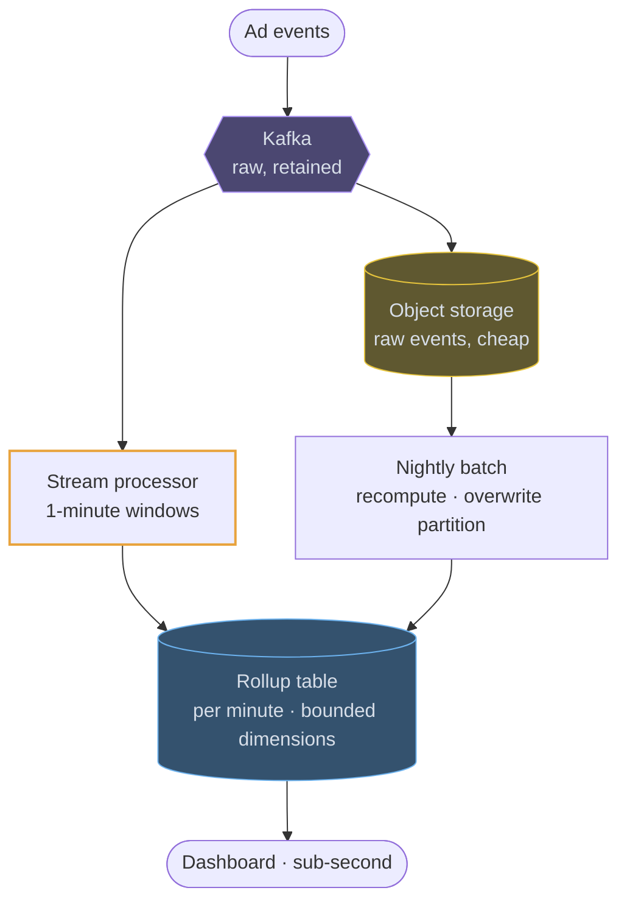
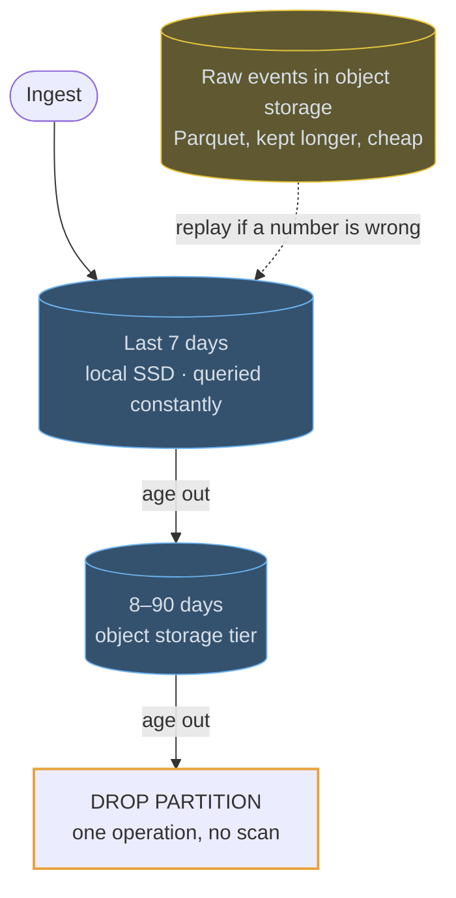

# OLAP stores

## Use cases

### Counting clicks per minute, at a billion a day

The standard pipeline: events land in Kafka, a stream processor windows and
pre-aggregates them, and the rollup table is what the dashboard queries. The
batch path exists because streams get late and duplicate events wrong, and
recomputing a partition is the cheapest way to make the numbers finally correct.



### A rollup for the dashboard, raw rows for the drill-down

Two tables, and knowing which query hits which is the design. The rollup is
bounded — a handful of dimensions, one row per minute per combination — and the
raw table keeps the high-cardinality columns for the rare query that needs a
single user or request.

```erd
# Pre-aggregated · what the dashboard reads
clicks_per_minute || sorted by (ad_id, minute); a day of one campaign is a few thousand rows || ClickHouse
+ ad_id || bigint || PK
+ minute_bucket || timestamp || PK
+ country || text || PK
+ device || text || PK
+ impressions || bigint
+ clicks || bigint
+ unique_users || HLL sketch
+ spend || decimal
# Raw · what the drill-down reads
click_events || partitioned by day; dropped, not deleted, at the end of retention || ClickHouse
+ ad_id || bigint || PK
+ ts || timestamp || SK
+ user_id || uuid
+ country || text
+ device || text
```

### Keeping the bill sane as data ages

Retention is a partition operation, not a `DELETE`. Recent partitions stay on
fast disk, older ones are tiered to object storage, and the oldest are dropped
whole — which is also the answer to "what does keeping a year of this cost?"


