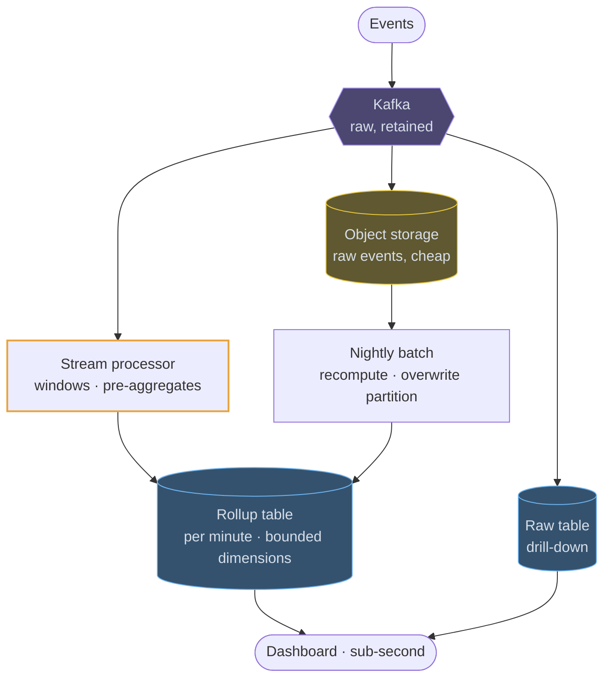

# OLAP stores

## How it works

An OLAP store answers questions like "clicks per campaign per minute for the last
30 days" over tables with hundreds of billions of rows. It does that by storing
data **by column instead of by row**.

That one change cascades. A query touching 3 of 50 columns reads 6% of the bytes.
A column holds values of one type, often nearly sorted and highly repetitive, so
compression ratios of 10x are routine — and compressed data means less disk and
less memory bandwidth, which is the actual bottleneck. Execution is vectorised:
the engine processes batches of thousands of values in tight loops rather than a
row at a time.

The trade is symmetrical. Fetching one whole row means touching every column file,
and updating a single value means rewriting a block. OLAP stores are written in
large appends and read in large aggregates. They are not a place for point lookups
and they are not transactional.

## The pipeline you will draw

Saying which part is precomputed and which is scanned at query time is the
interesting decision — it is the "now or later" trade in its purest form. The
batch path exists because streams get late and duplicate events wrong, and a
recomputed partition is the cheapest way to make the numbers finally correct.

## Where it fits in a design

An OLAP store is a read side, never an application database. If a request needs
one row by id, that is Postgres, Cassandra or DynamoDB.

> "Raw events in object storage, aggregates hot, and a batch job that corrects
> the stream" is the sentence that shows you have thought about the bill as well
> as the query.
