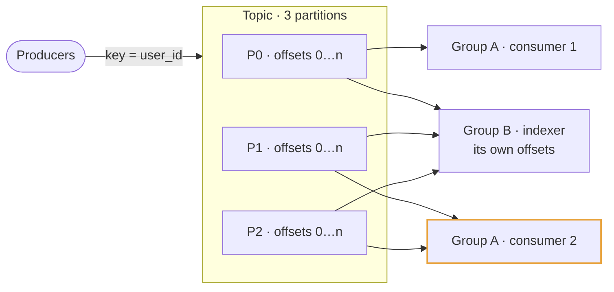
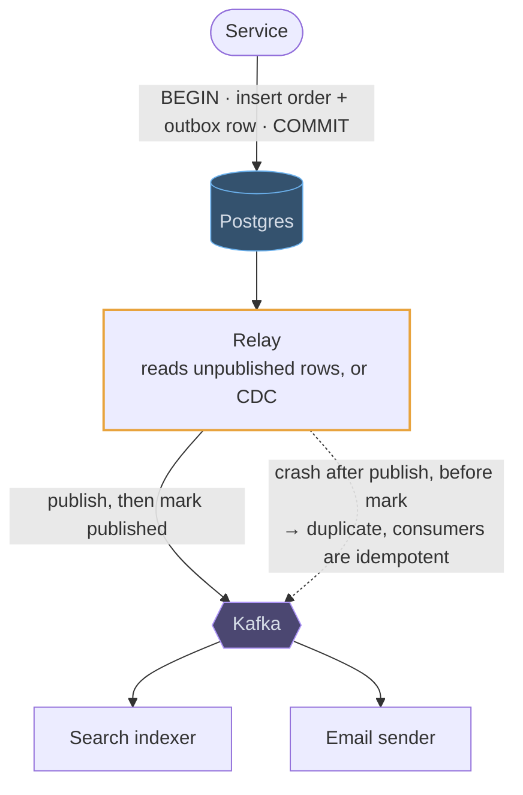
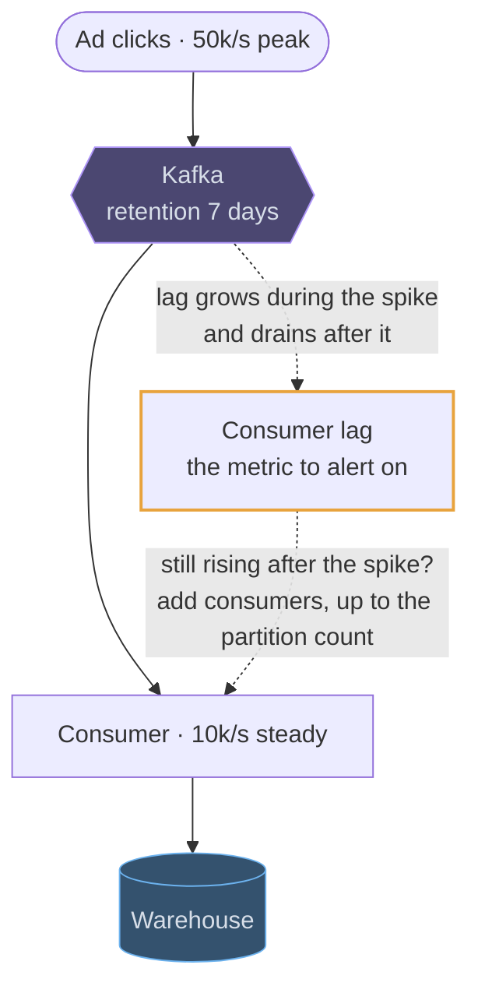
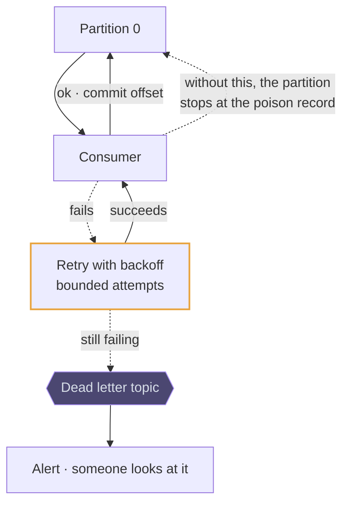

# Kafka

## Use cases

### One write, several independent readers

The property that separates a log from a queue. Notifications, analytics and a
search indexer each read the same partitions at their own pace with their own
offsets, and adding a fourth consumer later costs the producer nothing.



### Publishing database changes without a dual write

An event written to Kafka by the application *after* the database commit can be
lost; one written *before* can describe a transaction that rolled back. The
outbox row is written in the same transaction as the data, and a relay publishes
it afterwards, so the two can never disagree.

```erd
# Outbox · the same transaction as the data
orders || the business write
+ order_id || bigint || PK
+ state || text
outbox || inserted in the same transaction; the relay deletes it after publishing
+ id || bigint || PK
+ aggregate_id || bigint || → orders
+ event_type || text
+ payload || jsonb
+ published || boolean
```



### Absorbing a spike the downstream cannot take

A producer writing 50k events/s into a consumer that handles 10k/s does not fail:
lag grows and drains later. That decoupling of write rate from processing rate is
the structural reason to put a log between two services.



### Retries and a dead letter topic

A record that always fails blocks its partition, and everything behind it stops.
Retry with backoff a bounded number of times, then move it aside and keep going —
and alert on the dead letter topic, because it is where silent data loss hides.


