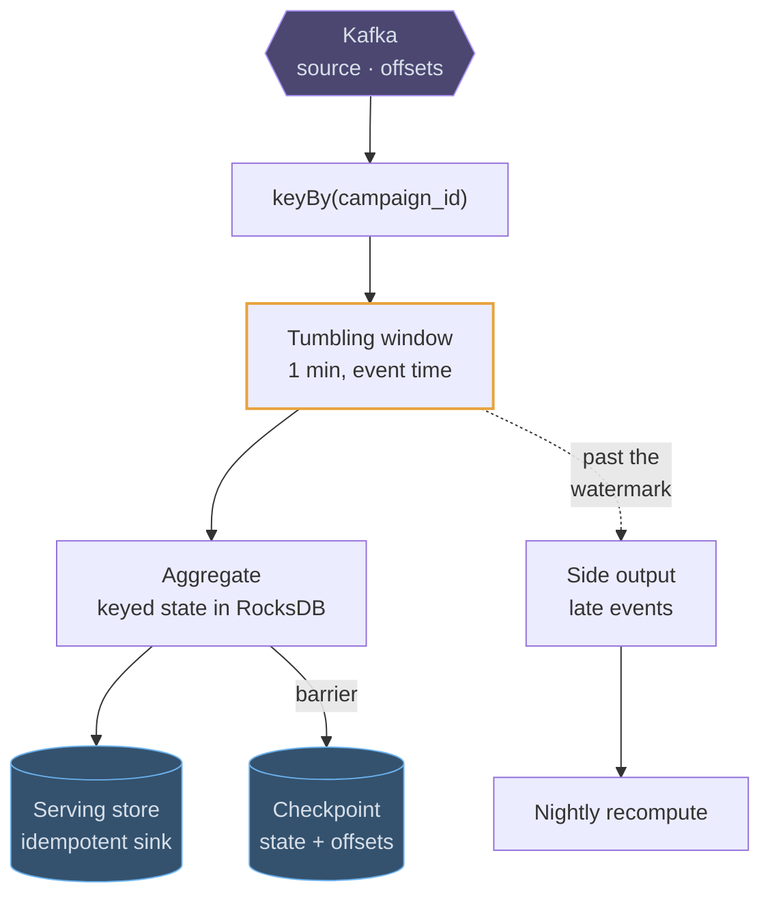
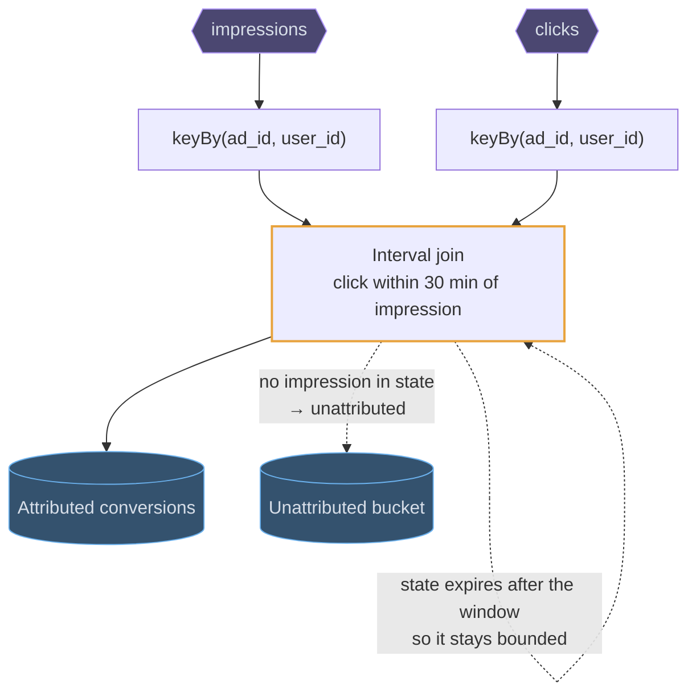
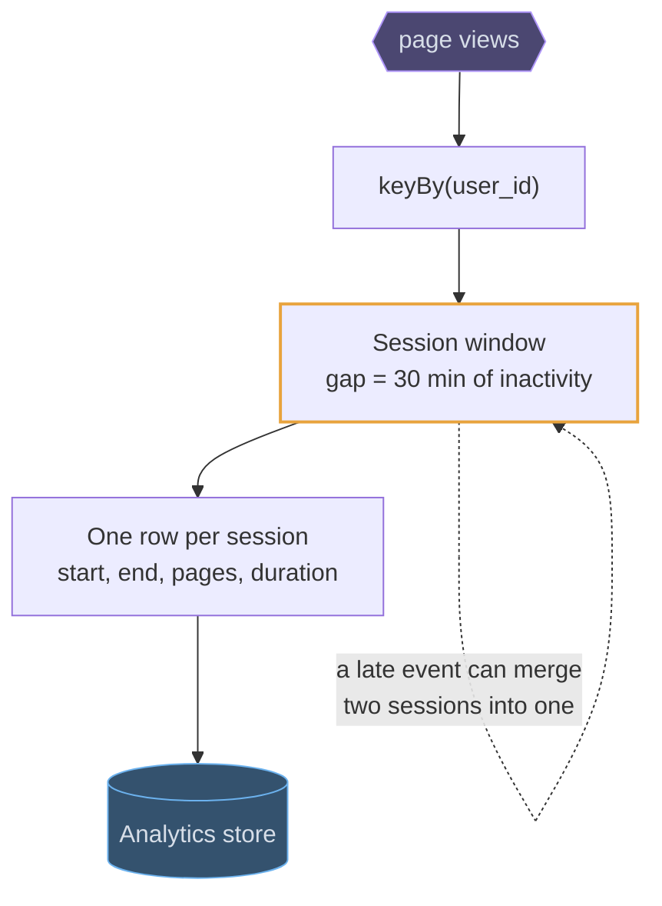
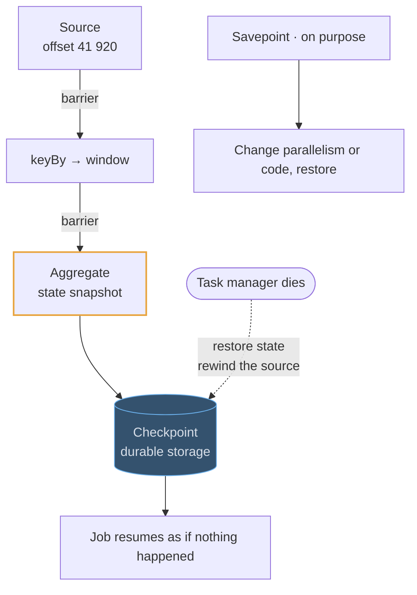

# Flink

## Use cases

### Clicks per campaign per minute, counted honestly

The canonical job. Events are keyed by campaign, windowed on **event time**, and
the window fires when the watermark passes its end — so a phone that was offline
for ten minutes still lands in the minute it clicked, not the minute it
reconnected.

### Attributing a click to its impression

A stream-to-stream join over a time window: hold impressions in keyed state for
30 minutes, and when a click arrives for the same ad and user, emit the pair.
State that expires is why this is a stream processor's job and not a database
query.

### Turning raw events into sessions

A session window groups a user's events until they go quiet for N minutes, which
is how a raw click stream becomes "a browsing session" — the unit product
analytics actually wants, and one that no fixed window can express.

### Surviving a crash, and a traffic doubling

Checkpoints are what make a stateful job restartable: a barrier flows through the
graph and snapshots every operator's state with the offsets that produced it, so
recovery is "restore and rewind". The same mechanism, triggered by hand, is how
you rescale.

