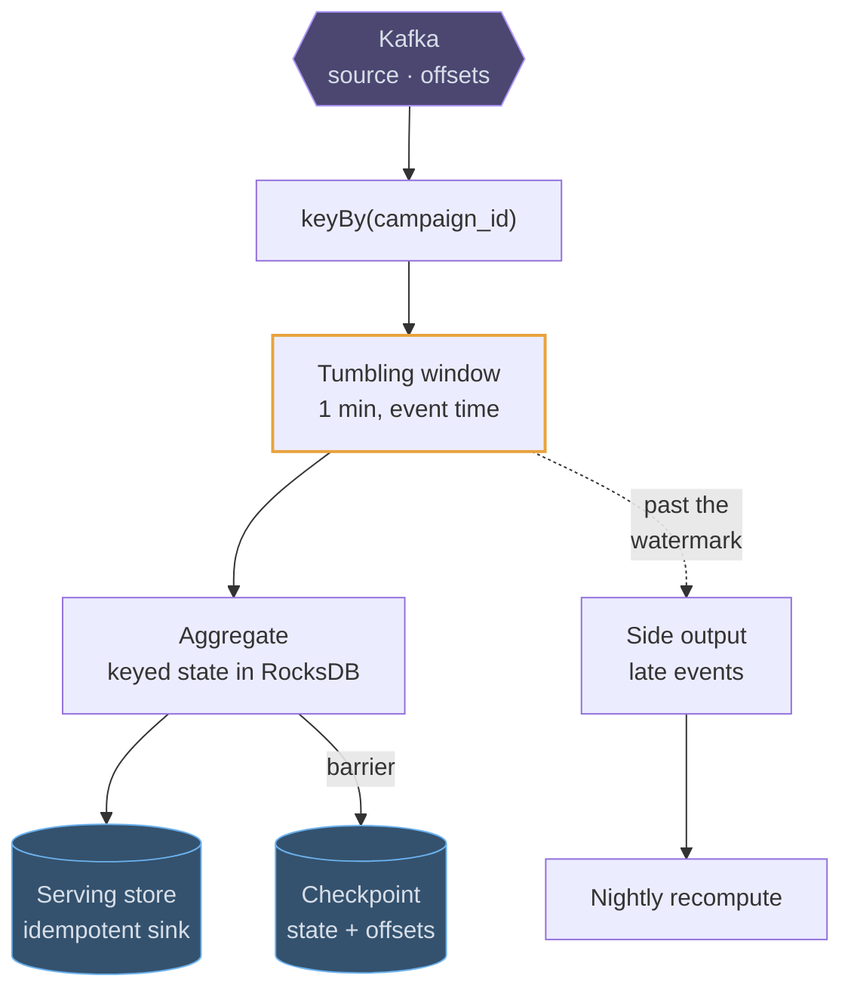

# Flink

## How it works

Flink runs a graph of operators over a stream that never ends. Records flow from a
source (usually Kafka) through map, filter, keyBy, window and aggregate operators,
into a sink (an OLAP store, a key-value store, another topic). Operators run in
parallel across task slots, and a `keyBy` partitions the stream by key so all
records for one key reach the same instance.

The thing that separates a stream processor from a consumer loop is **managed
state**. An operator can hold a running count, a session, or the last value per
key — potentially terabytes, backed by RocksDB on local disk — and Flink makes that
state fault-tolerant. Periodically it injects a barrier that flows through the
graph and produces a **checkpoint**: a consistent snapshot of every operator's
state plus the source offsets. On failure it restores the snapshot and rewinds the
source, so the computation continues as if nothing happened.

**Savepoints** are the same mechanism triggered by hand, which is how a job is
upgraded or rescaled without losing state.

## Where it fits in a design

Flink sits in the middle: **Kafka → Flink → a serving store**. It earns its
complexity when state is large, windows are real, and event time matters.

> The dashed path is the one interviewers follow: what happens to the events that
> arrive after you already published the number.
