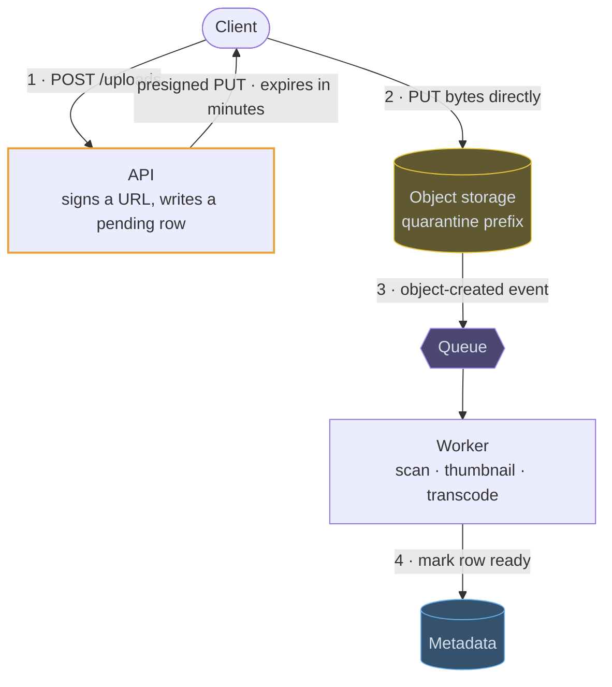
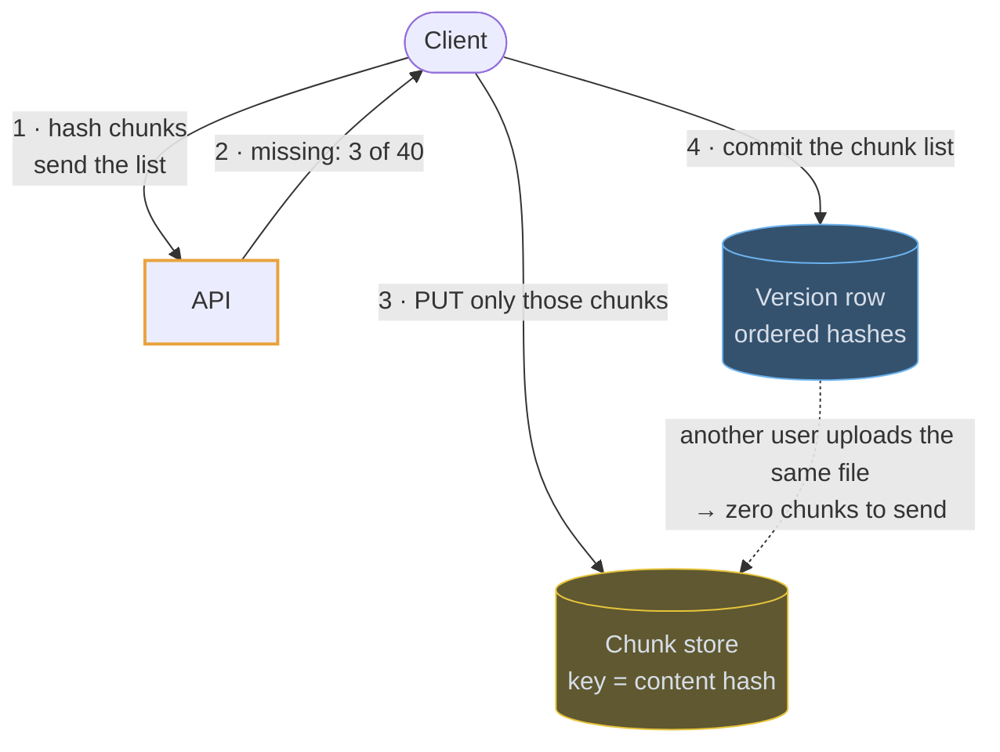
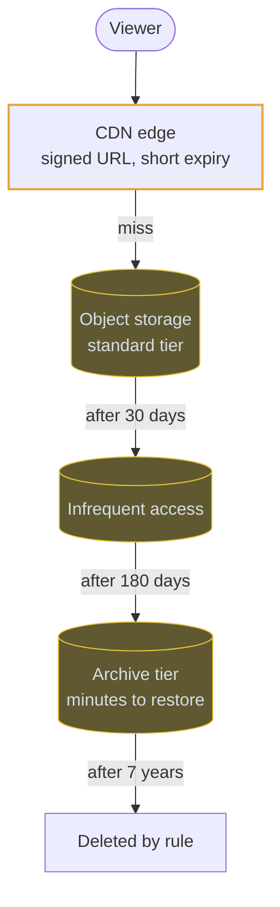

# Object storage

## Use cases

### Uploads that never touch your servers

The one thing to say about object storage in an interview. The API signs a URL
and records a pending row, the client `PUT`s the bytes directly, and the bucket's
own event marks the row ready — so a client that dies mid-upload leaves an orphan
for a lifecycle rule rather than a broken record.



### Metadata you can query, bytes you cannot

The split that shows up in every file design. Everything the application filters,
sorts or authorises on lives in a row; the bytes live under a key that the row
points at.

```erd
# Metadata · your database
files || small, queryable, and the only thing the API reads on a list
+ file_id || uuid || PK
+ owner_id || uuid
+ object_key || text
+ content_type || text
+ size || bigint
+ status || pending | clean | rejected
+ created_at || timestamptz
# Bytes · object storage
bucket || immutable; versioning gives undelete, lifecycle moves it to cold tiers || S3-style
+ key || users/123/avatar.jpg
+ body || bytes
+ version_id || text
```

### Syncing a large file by chunks

Hash fixed-size chunks on the client, ask which ones the server is missing, and
upload only those. Deduplication across users, resume after a dropped connection
and cheap versioning all fall out of the same content-addressed store.



### Serving the bytes, and ageing them out

Object storage is an origin. A CDN serves users, signed URLs keep private media
private, and lifecycle rules move cold objects down the tiers — which is the
one-line answer to what a petabyte of logs costs.


