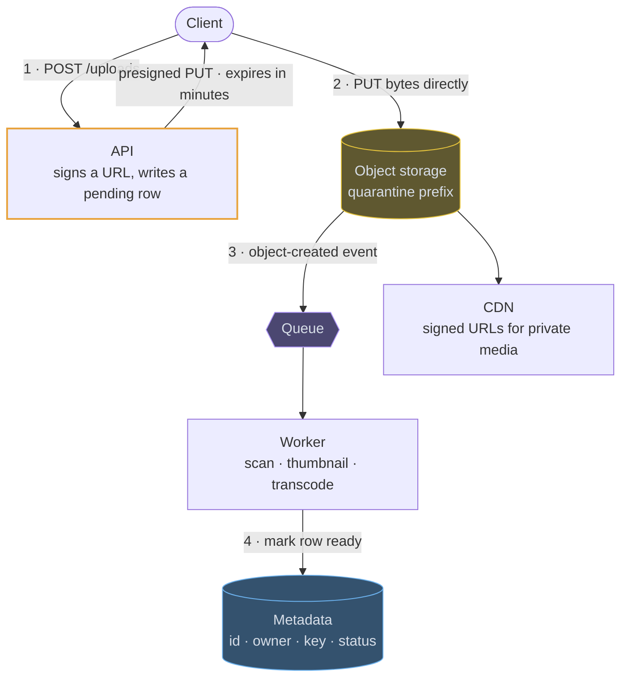

# Object storage

## How it works

Object storage is an HTTP key-value store for immutable blobs. You `PUT` bytes
under a key in a bucket and `GET` them back. There are no directories — a key like
`users/123/avatar.jpg` is a flat string that merely looks like a path — no partial
updates, and no file handles.

What you buy is durability and scale that nothing else offers at the price. What
you give up is latency and any ability to query the contents.

## The upload flow, in four steps



The bytes never pass through the application, and the row is only marked ready by
the event, so a client that dies mid-upload leaves an orphan for a lifecycle rule
rather than a broken record.

## Blob here, metadata there

```erd
# Metadata · your database
files || the row is small and queryable; the bytes are not here
+ file_id || uuid || PK
+ owner_id || uuid
+ object_key || text
+ content_type || text
+ size || bigint
+ status || pending | clean | rejected
+ created_at || timestamptz
# Bytes · object storage
bucket || immutable; versioning gives undelete, lifecycle moves it to cold tiers || S3-style
+ key || users/123/avatar.jpg
+ body || bytes
+ version_id || text
```

> The pattern is always the same, and worth stating explicitly: the blob goes in
> object storage, the metadata goes in a database, and nothing large ever passes
> through your application.
