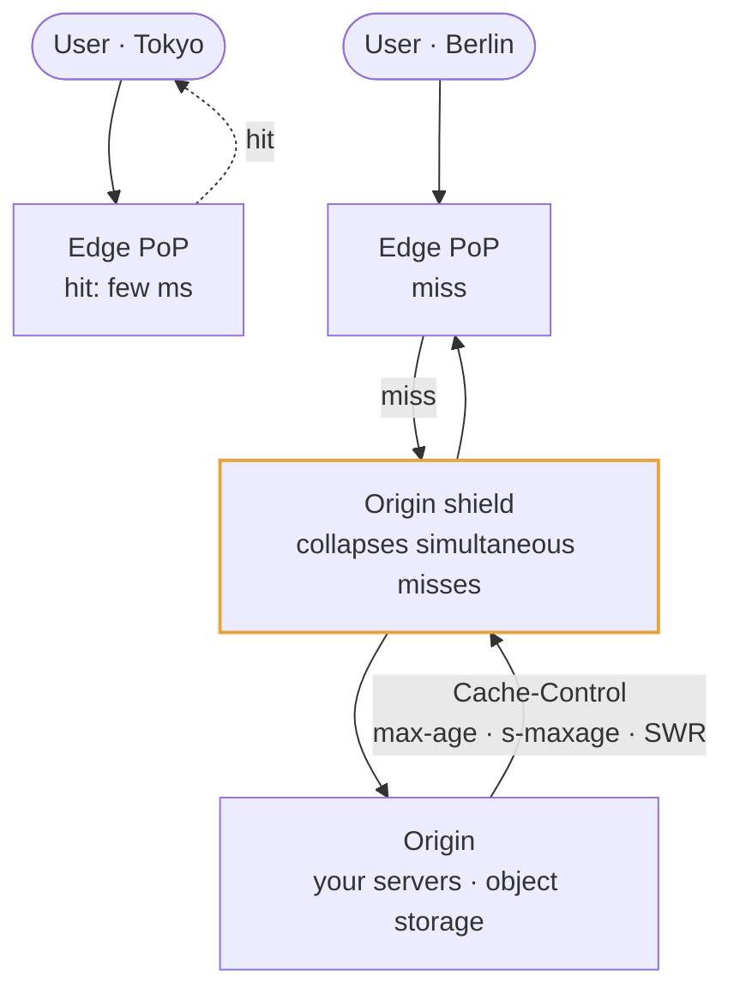

# CDN

## How it works

A CDN is a fleet of caching proxies in points of presence around the world.
Anycast routing sends a user to a nearby one; if that edge has the content it
serves it in a few milliseconds, and if not it fetches from your origin, stores it,
and serves everyone else from the copy.

Two things follow. **Latency** drops because distance drops — a round trip to
another continent costs 150 ms no matter how fast your servers are. And **origin
load** drops by whatever the hit ratio is.

The **origin shield** is the part people forget: a designated mid-tier cache that
all edges fetch through, so a viral object causes one origin fetch rather than
hundreds of simultaneous misses.

## Where it fits in a design

Put it in the diagram whenever there are assets or geography, then reach for it
deliberately when the hard part is a read spike, a celebrity key, or a global
latency budget.

> The edge is what stands between a hundred thousand simultaneous readers and
> your database. That is a capacity argument, not a polish one.
