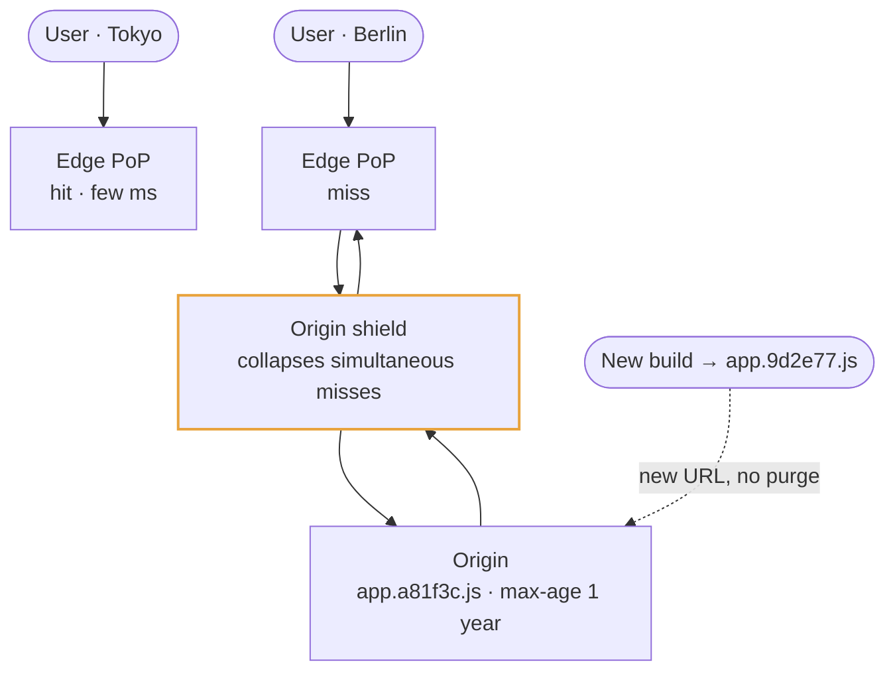
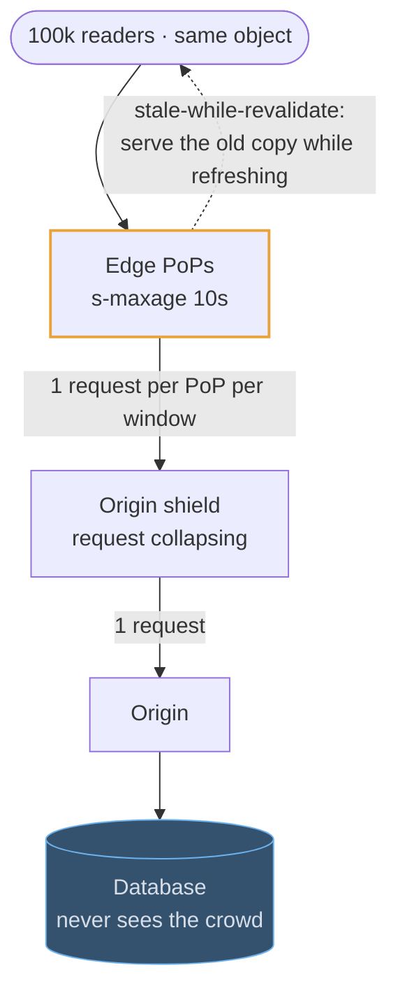
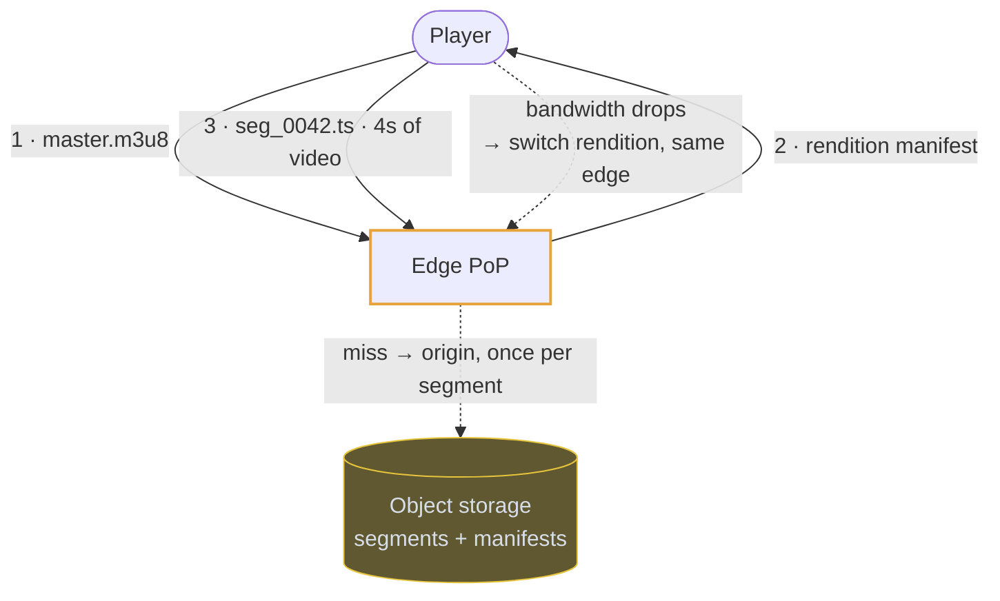
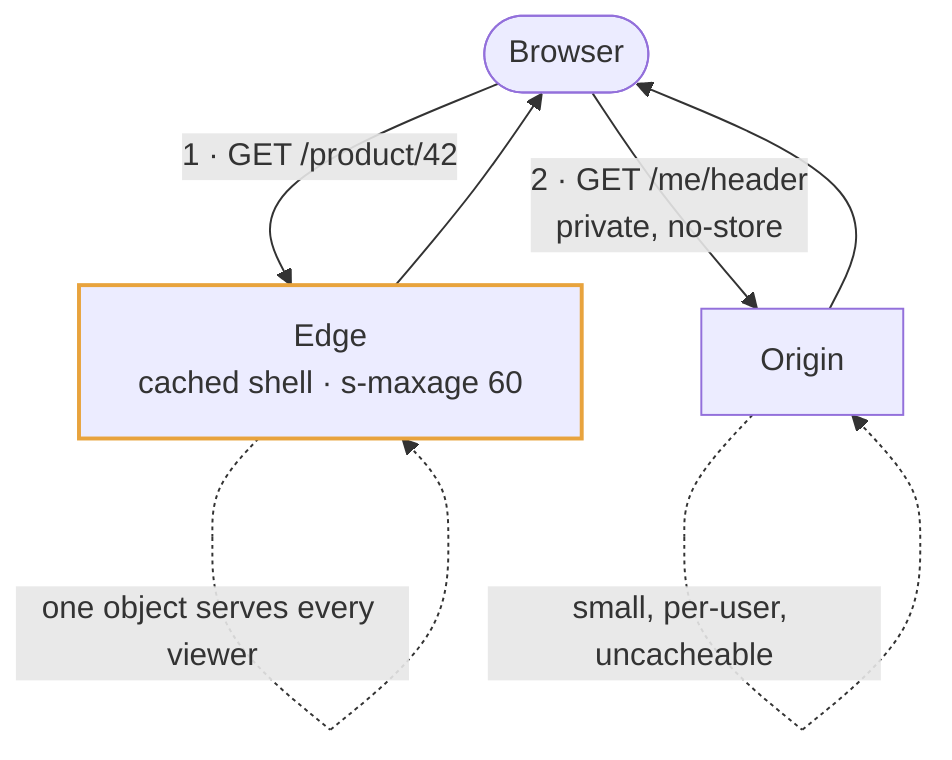

# CDN

## Use cases

### Static assets, cached for a year

Versioned filenames make invalidation a non-problem: the URL changes when the
content does, so the edge can hold the old one forever and no purge has to
propagate. This is the uncontroversial case, and it takes one sentence in an
interview.

### Absorbing a read spike

A ticket on-sale or a viral post is a hundred thousand readers wanting the same
bytes. Cached at the edge for even ten seconds, the origin sees one request per
PoP per window instead of the flood — which is a capacity argument, not a polish
one.

### Delivering video

HLS and DASH cut a stream into a manifest plus a few seconds of video per file.
Those segment files are static and immutable, so they cache perfectly — the CDN
is not an optimisation here, it is how the video reaches anyone.

### Caching a page that is partly personal

If every response embeds the viewer's name, nothing is shared and nothing caches.
Split it: the shell is one cached object for everyone, and the personal fragment
is a separate, uncached call the client makes after paint.

