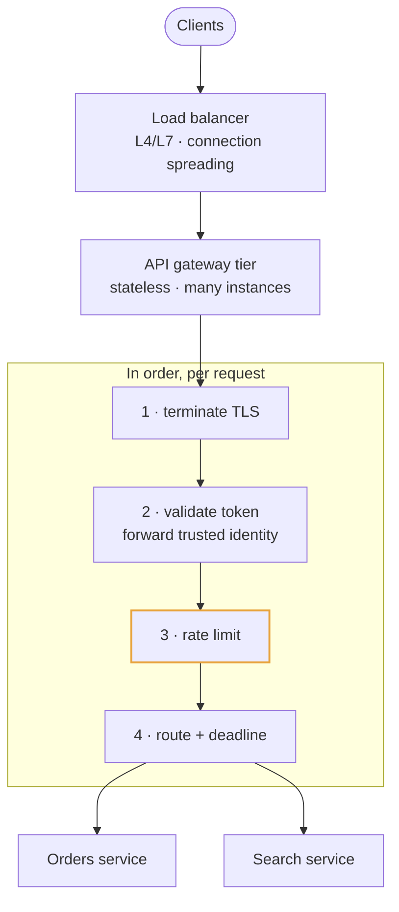
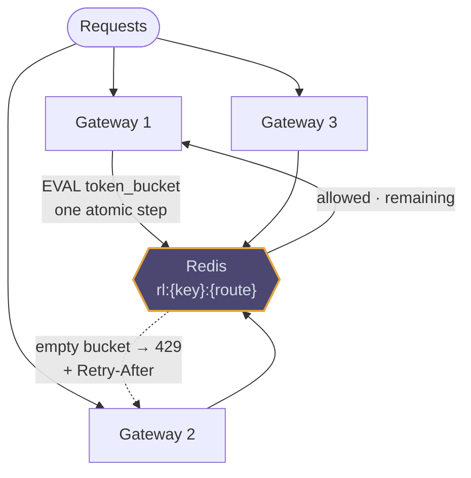
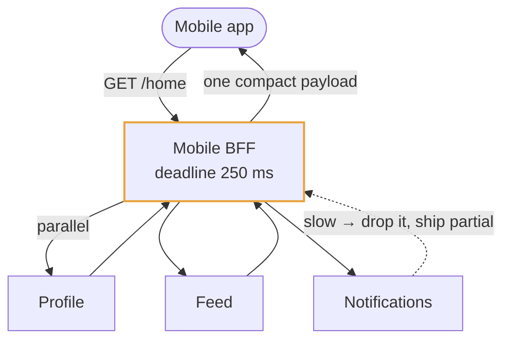
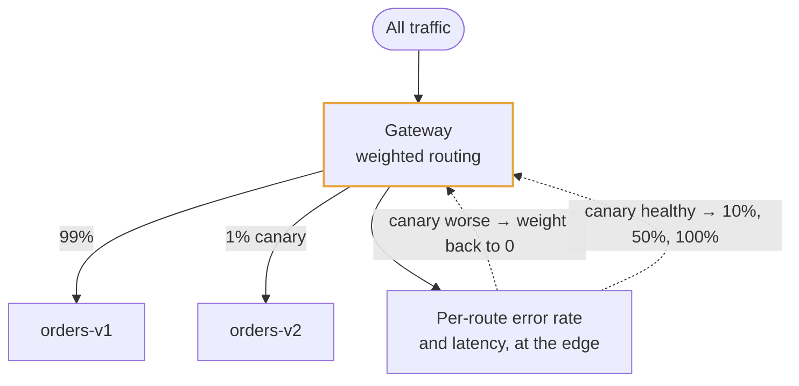

# API gateway

## Use cases

### One front door for every request

Cross-cutting concerns live in one tier instead of being reimplemented in each
service: terminate TLS, validate the token, apply the quota, set a deadline,
route. In an interview this is one sentence and a box — it is table stakes, not a
talking point.

### A rate limit that counts every instance

Per-instance counters silently let through N times your limit, because each
gateway only sees its own share of traffic. The bucket lives in Redis and the
check-and-decrement is one Lua script, so the limit is global and atomic.

### One call instead of eight, for mobile

A backend-for-frontend is a gateway specialised per client: it fans out in
parallel, sets a deadline per call, and returns a compact payload shaped for one
screen. The trap is latency — a BFF is as slow as its slowest dependency unless
it degrades.

### Shifting traffic to a new version

Header- and weight-based routing is how a migration happens without a flag day:
1% of traffic to the new implementation, watch its error rate and latency at the
gateway (which already sees every request), then move the dial.

