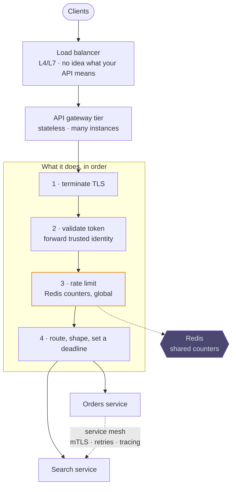

# API gateway

## How it works

An API gateway is a reverse proxy that every external request passes through
before reaching a service. It exists so that the cross-cutting concerns — the ones
every service would otherwise reimplement — live in one tier.

The gateway is itself a horizontally scaled, stateless tier behind that load
balancer, which is the answer to "isn't it a single point of failure?"

## Where it fits in a design

Draw it, say in one sentence what it does — *terminates TLS, validates the token,
applies the per-user rate limit, routes to the right service* — and move on. Give
it real attention only when the problem is about the edge itself.

> The gateway routes and protects; it does not know your domain. That line is
> what keeps it from becoming the system.
