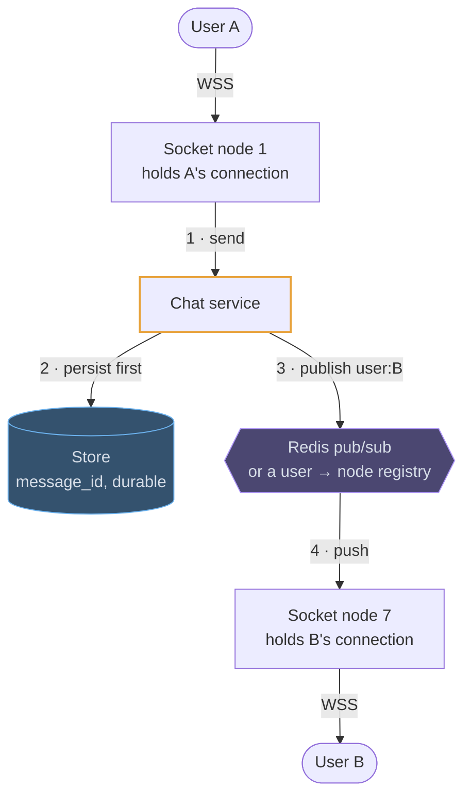
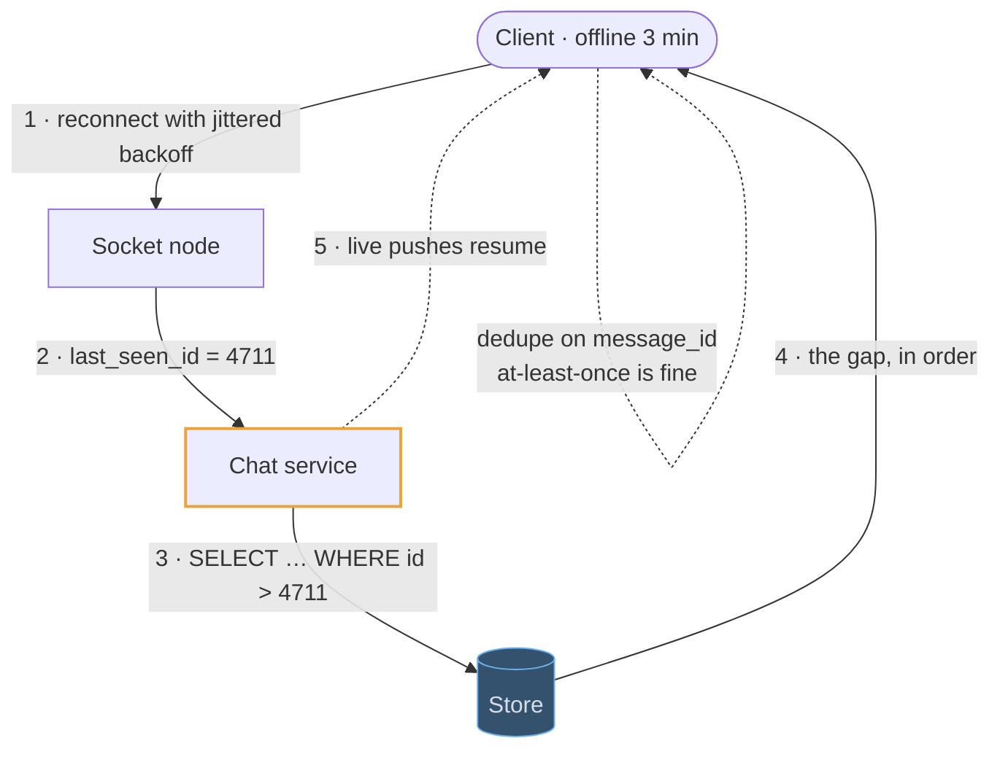
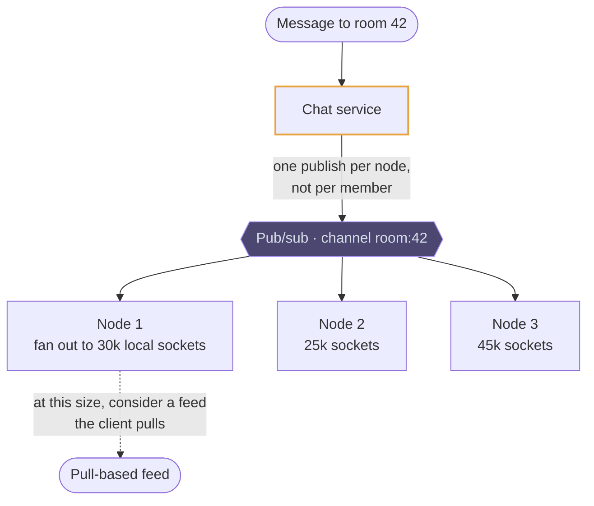

# WebSockets

## Use cases

### Delivering a chat message to the right node

The whole design in one picture: the sender's socket is on node 1, the
recipient's on node 7, and the message has to cross. Persist before publishing,
so a dropped push costs a reconnect rather than a message.



### Coming back after the tunnel

Connections drop constantly, so the interesting path is the reconnect: the client
sends the highest message id it holds, the server returns everything after it
from durable storage, and only then does the live stream resume.



### Presence, without lying about it

Presence is heartbeats plus a TTL: each node refreshes a key while the socket is
alive, and the key expiring *is* the disconnect event. Without it, TCP will
happily hold a connection to a phone that left the network minutes ago.

```erd
# Presence · Redis, all keys expire
presence:{user_id} || refreshed by the socket node every 20s; the TTL expiring is the disconnect || Redis hash
+ node_id || text
+ last_ping || timestamp
+ ttl || 45 seconds
conn:{node_id} || which sockets a node holds, so a restart can clean up after itself || set
+ member || user_id
```

### Fanning out to a big room

One message to a 100k-member channel is 100k sends. Batch per node so the
publish crosses the network once per node rather than once per member — and at
some size, admit that a pull-based feed is the right answer instead.


