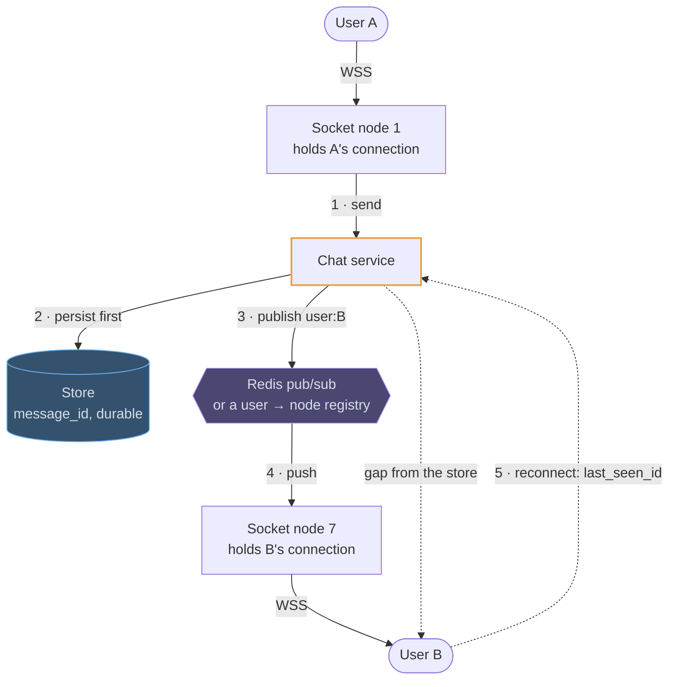

# WebSockets

## How it works

A WebSocket starts as an HTTP request with an `Upgrade` header and becomes a
persistent, full-duplex TCP connection. Either side can send a message at any
time, with a few bytes of framing overhead instead of a full HTTP request.

The hard part is not the protocol; it is that the tier holding the connections is
stateful, so the message and the socket rarely arrive at the same node.

Step 2 before step 3 is the whole reliability story: the message is durable before
anyone is told about it, so a dropped publish costs a round trip on reconnect
rather than a lost message.

## Where it fits in a design

> The right way to introduce it is to say what it costs in the same breath:
> *"clients hold WebSockets to a dedicated gateway tier; that tier is stateful, so
> I need a connection registry in Redis, heartbeats, and a resume-from-cursor path
> on reconnect."*

That sentence answers most of the follow-ups before they are asked.
