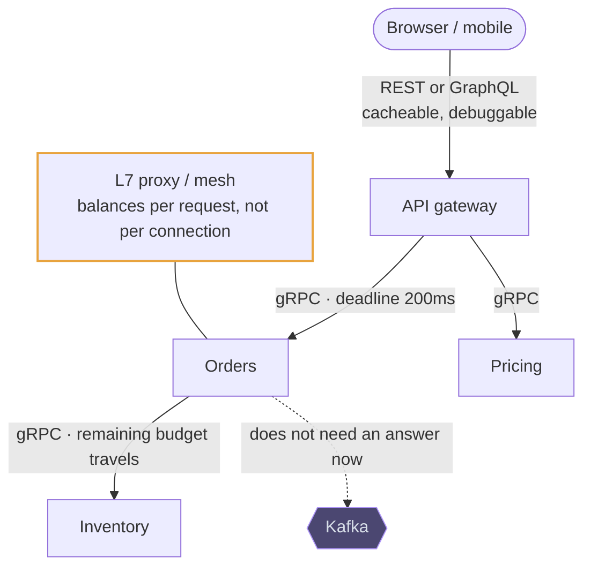

# gRPC

## How it works

gRPC is a remote procedure call framework. You define services and messages in a
`.proto` file, generate client and server code in whatever languages you use, and
call a remote method as if it were local. Messages travel as **Protocol Buffers** —
a compact binary encoding, typically half to a third the size of the equivalent
JSON and much faster to parse.

It runs over **HTTP/2**, which brings multiplexing (many concurrent calls on one
connection, no head-of-line blocking at the HTTP layer), binary framing, header
compression and flow control. One TCP connection carries the traffic that REST
would spread over a pool.

The dashed edge is the decision most often got wrong: a synchronous RPC where an
event would do. The annotated proxy is the second: one long-lived HTTP/2
connection needs request-level balancing, or all your traffic lands on one
backend.

## Where it fits in a design

> *REST or GraphQL for clients, gRPC between services, Kafka when it does not
> need to be synchronous.*

That one line answers the transport question for most designs, and leaves you
time for the parts that are actually hard.
