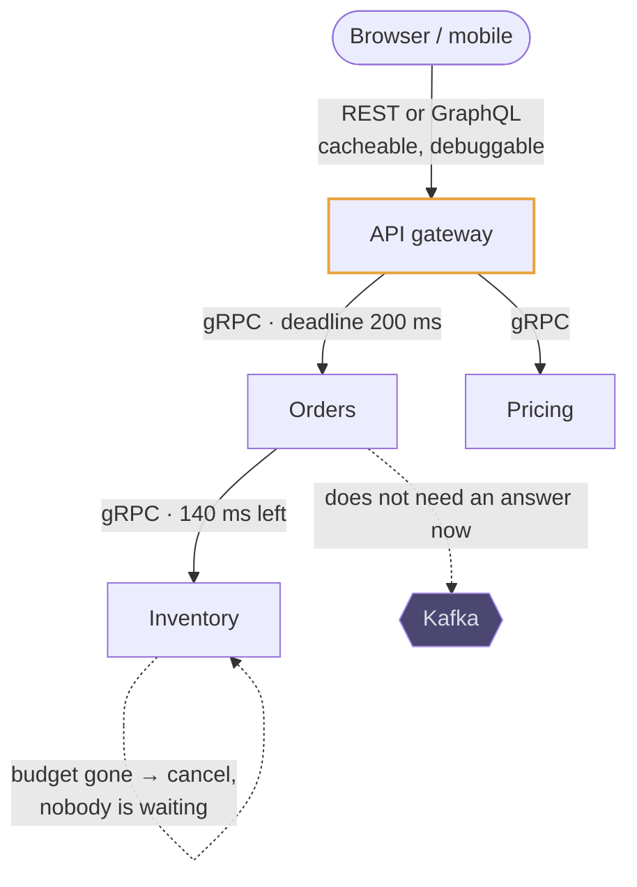
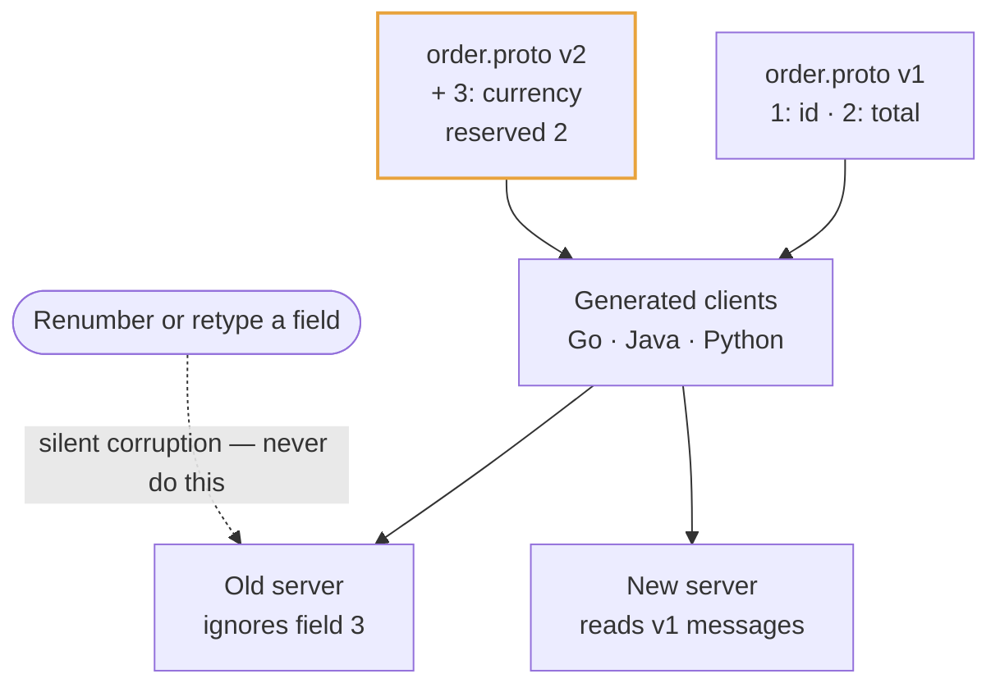
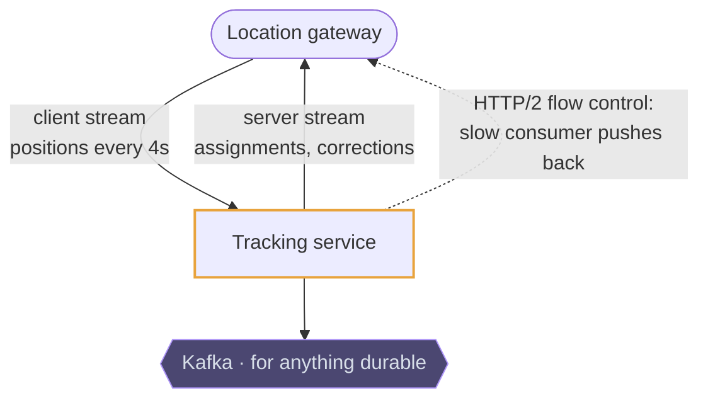
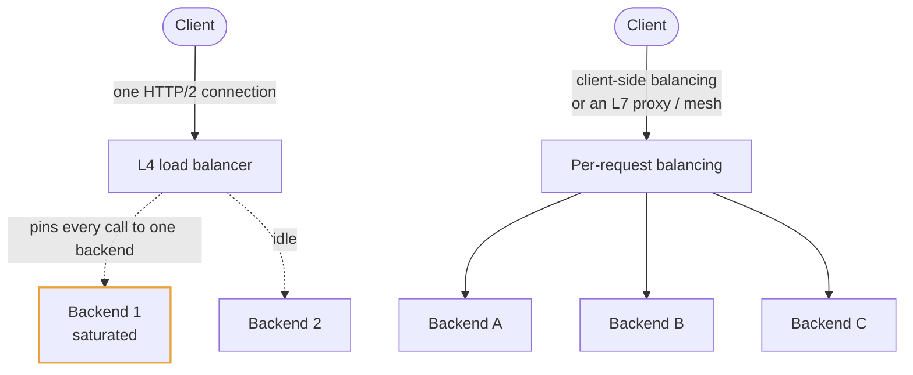

# gRPC

## Use cases

### Service-to-service calls with one deadline

Behind the edge, where payload size and parse cost show up in the p99 and every
caller is your own code. The deadline set at the gateway travels with the call,
so the fifth hop knows how much budget is left and abandons work nobody is
waiting for.

### Changing a message without breaking a caller

Field numbers, not names, are on the wire, so an old server ignores a field it
has never heard of and a new server reads an old message fine. That is the
property that makes a polyglot estate with dozens of services survivable.

### Streaming telemetry between backends

Bidirectional streaming over one connection is what makes continuous flows —
driver locations, metrics, live model scores — cheap: no per-message request
overhead, and flow control that pushes back when the consumer falls behind.

### Balancing load across one long connection

The trap that separates reading about gRPC from running it: HTTP/2 keeps a single
connection, so a connection-level balancer pins a client to one backend forever.
Balance per request instead — in the client, or in an L7 proxy or mesh.

