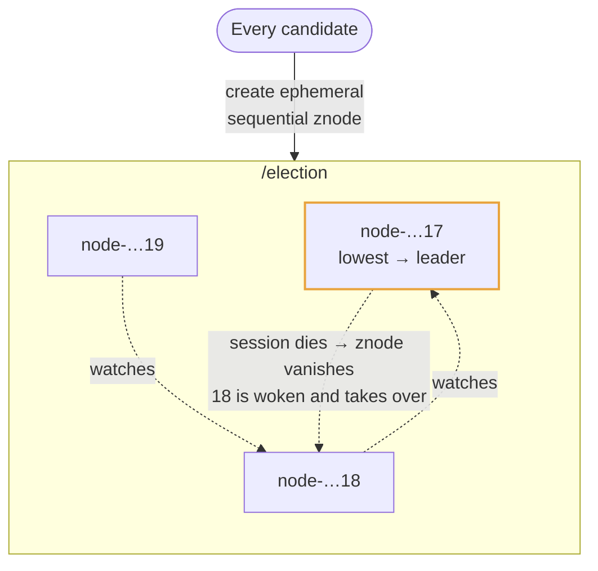
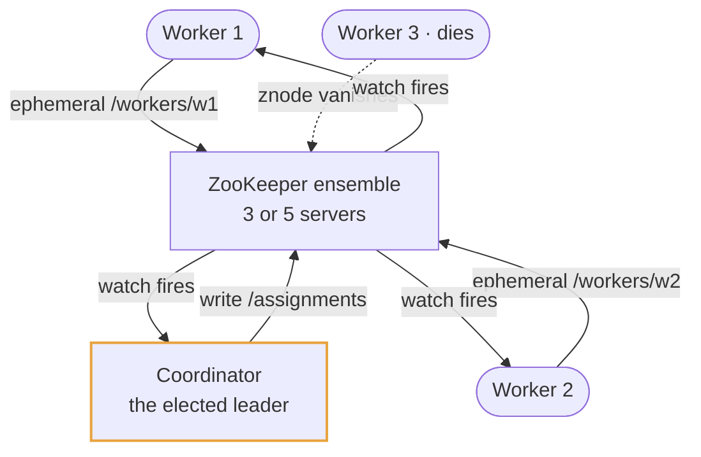
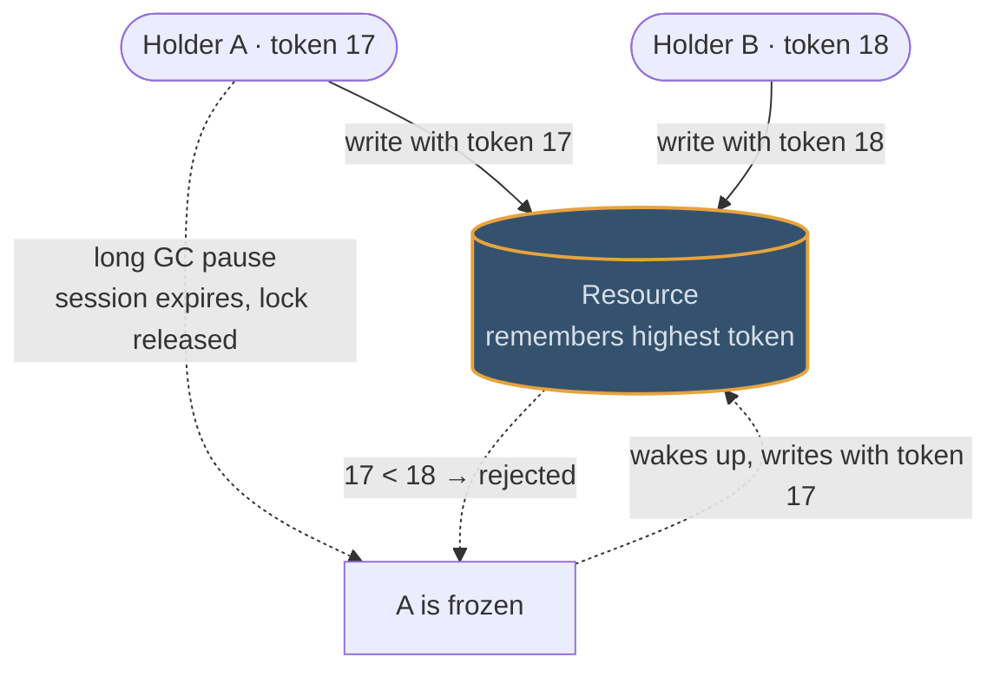
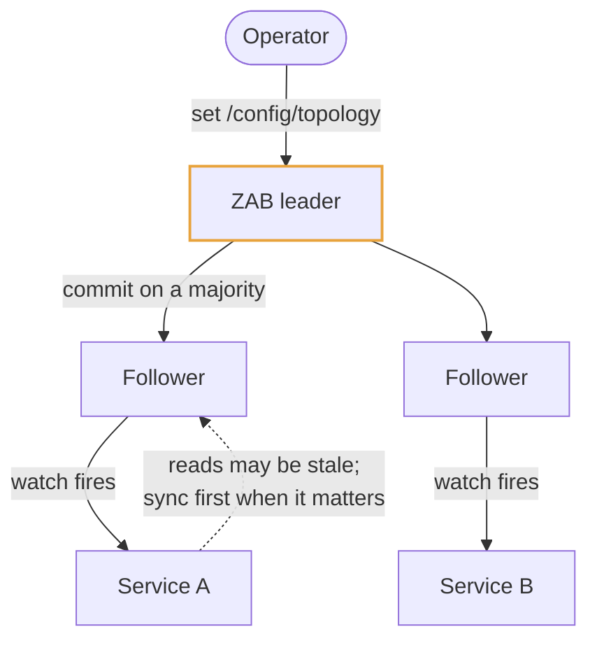

# ZooKeeper

## Use cases

### Electing exactly one leader

The canonical recipe, and the one to be able to sketch. Every candidate creates
an ephemeral sequential node; the lowest sequence number leads. Each other
candidate watches only the node directly below it, so one failure wakes one
client rather than a herd.

### Knowing who is alive, and who owns which shard

Workers register ephemeral nodes; the elected coordinator watches that directory
and writes a shard-to-worker map into a znode; workers watch the map. Joins and
failures arrive as events, and "exactly one process per shard" holds without
anybody polling.

### A lock that survives a GC pause

The reason to use a consensus system rather than a cache for a lock that protects
money. The sequence number is a **fencing token**: the resource remembers the
highest it has seen, so a paused holder that wakes up late is rejected instead of
writing over the new holder's work.

### Config every node must agree on

Feature flags, cluster topology, schema versions: written once through the
leader, watched by everyone, and converged on within a heartbeat. Small, rarely
written, and read by every node — which is precisely the shape it is built for.

