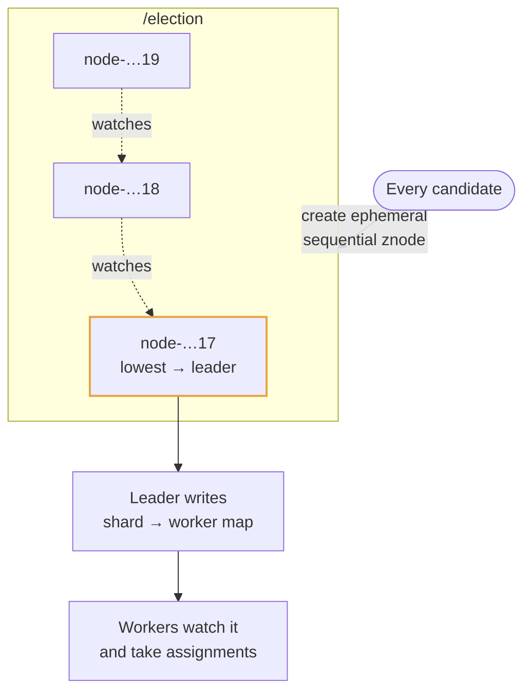

# ZooKeeper

## How it works

ZooKeeper is not a database. It is a replicated, strongly consistent store for
tiny amounts of metadata that a distributed system must agree on: which node is
the leader, which nodes are alive, which worker owns which partition.

An ensemble of typically three or five servers runs the **ZAB** protocol: all
writes go through a leader and are committed once a majority have them, so writes
are linearizable and survive the loss of a minority.

Two primitives do most of the work. **Ephemeral znodes** exist only while the
client's session is alive — the client heartbeats, and if it stops, the node
vanishes, which is failure detection with no extra machinery. **Sequential znodes**
get a monotonically increasing suffix, which gives a total order. **Watches** let a
client be notified once when a znode changes, instead of polling.

## Leader election, drawn

Each candidate watches only its predecessor, so one failure wakes one client
rather than the whole herd. The sequence number doubles as a **fencing token**:
pass it to whatever the leader writes to, and a paused leader that wakes up late
is rejected.

## Where it fits in a design

Name it lightly. In most designs one sentence is enough — *"a ZooKeeper or etcd
ensemble holds the shard assignment and elects the coordinator"* — and the rest of
your time is better spent on the data path.

> It deserves more only when the design is *about* coordination: a distributed
> scheduler, a custom sharded store, or anything where you are building a cluster
> rather than using one.
